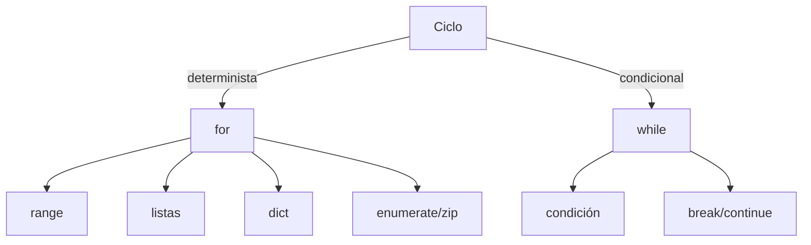

#  Semana 3 - ciclos en Python  

## 1. Introducción

Los **ciclos (o bucles)** permiten ejecutar un bloque de código *repetidamente* sin necesidad de reescribirlo.  
En Python existen **dos construcciones básicas**:

| Construcción | Uso típico | ¿Termina automáticamente? |
|--------------|------------|---------------------------|
| `for`        | Recorrer iterables | Sí, cuando el iterable se agota |
| `while`      | Repetir mientras se cumpla una condición | No, puede ser infinito si no se actualiza la condición |

A su vez, cada construcción admite **flujos de control** (`break`, `continue`, `else`) y combinaciones avanzadas (`else`, `else` + `continue`, `else` + `break`).  

---

## 2. Ciclo `for`

### 2.1 Sintaxis básica

```python
for variable in iterable:
    # bloque a repetir
else:          # opcional
    # se ejecuta si NO hubo break
```

### 2.2 Objetos iterables más usados

| Iterable | Ejemplo | ¿Qué recorre? |
|----------|---------|---------------|
| `range()` | `range(5)` | Números enteros |
| `list` | `[1, 2, 3]` | Elementos de la lista |
| `str` | `"abc"` | Caracteres |
| `dict` | `{"a": 1, "b": 2}` | Claves (por defecto) |
| `enumerate()` | `enumerate(["x", "y"])` | Pares (índice, elemento) |
| `zip()` | `zip(l1, l2)` | Tuplas emparejadas |
| Generador | `(x**2 for x in range(3))` | Valores producidos bajo demanda |

### 2.3 Ejemplos paso a paso

#### 2.3.1 Recorrer un rango

```python
for n in range(1, 6):      # 1,2,3,4,5
    print("n =", n)
```

#### 2.3.2 Recorrer una lista con desempaquetado

```python
productos = [("Manzanas", 3), ("Peras", 5)]
for nombre, cantidad in productos:
    print(f"{nombre}: {cantidad} kg")
```

#### 2.3.3 Recorrer diccionarios

```python
precios = {"manzana": 1.2, "pera": 0.9}
for fruta, precio in precios.items():
    print(f"{fruta} cuesta ${precio}")
```

#### 2.3.4 Usar `enumerate` para índice + valor

```python
palabras = ["sol", "luna", "estrella"]
for idx, pal in enumerate(palabras, start=1):
    print(f"{idx}. {pal}")
```

#### 2.3.5 Recorrer dos listas al mismo tiempo (`zip`)

```python
nombres = ["Ana", "Luis", "Eva"]
edades = [25, 30, 22]
for nom, ed in zip(nombres, edades):
    print(f"{nom} tiene {ed} años")
```

#### 2.3.6 Bucle anidado (nested for)

```python
for i in range(1, 4):
    for j in range(1, 3):
        print(f"i={i}, j={j}")
```

#### 2.3.7 Comprensión de listas (for en una sola línea)

```python
cuadrados = [x**2 for x in range(5)]   # [0, 1, 4, 9, 16]
```

---

## 3. Ciclo `while`

### 3.1 Sintaxis básica

```python
while condición:
    # bloque a repetir
else:          # opcional
    # se ejecuta si la condición es falsa y NO hubo break
```

### 3.2 Ejemplos paso a paso

#### 3.2.1 Contador simple

```python
cont = 0
while cont < 3:
    print(cont)
    cont += 1
```

#### 3.2.2 Lectura hasta *sentinela*

```python
total = 0
while True:
    n = input("Número (q para salir): ")
    if n == "q":
        break
    total += float(n)
print("Total:", total)
```

#### 3.2.3 Re-try con `continue`

```python
import random
while True:
    dado = random.randint(1, 6)
    if dado == 6:
        continue           # volver a tirar
    print("Sacaste", dado)
    break                  # terminar
```

#### 3.2.4 `else` en while

```python
i = 0
while i < 3:
    print(i)
    i += 1
else:
    print("Terminó sin break")
```

---

## 4. Flujos de control dentro de ciclos

| Sentencia | Qué hace | Ejemplo |
|-----------|----------|---------|
| `break`   | Salir del ciclo inmediatamente | `if x < 0: break` |
| `continue`| Saltar al siguiente ciclo | `if x % 2 == 0: continue` |
| `else`    | Ejecutar solo si no hubo `break` | Ver secciones anteriores |

---

## 5. Ciclos “infinitos” y sus formas de salir

```python
# Opción 1: while True + break
while True:
    opcion = input("> ")
    if opcion == "salir":
        break

# Opción 2: flag externa
seguir = True
while seguir:
    ...
    if condicion:
        seguir = False
```

---

## 6. Iteradores y generadores (avanzado)

### 6.1 Uso de `iter()` y `next()`

```python
it = iter([10, 20, 30])
print(next(it))  # 10
print(next(it))  # 20
```

---

## 7. Resumen visual



---

## 8. Mejores prácticas y recomendaciones

1. **Preferir `for` sobre `while`** cuando se conoce la cantidad de iteraciones.
2. **Evitar ciclos infinitos** sin mecanismo de salida claro.
3. **Usar nombres descriptivos** para variables de control.
4. **Aprovechar `enumerate` y `zip`** para código más legible.

---

